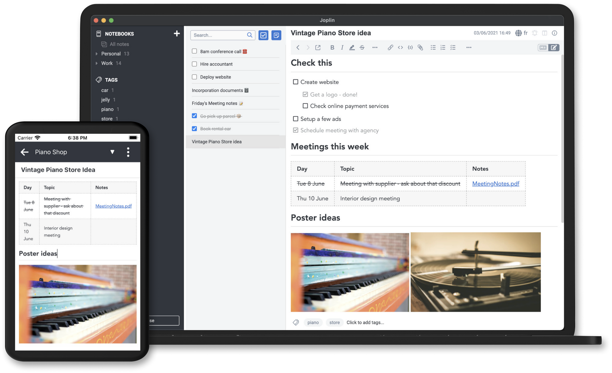
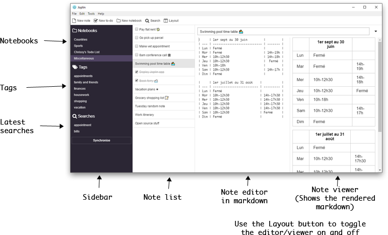

# NoteTrekker

<div align="center">
  
  <h3>A Modern Note-Taking Application</h3>
  <p>Built with React, TypeScript, and Express - Inspired by Joplin</p>
</div>

<div align="center">
  <a href="#features">Features</a> •
  <a href="#screenshots">Screenshots</a> •
  <a href="#tech-stack">Tech Stack</a> •
  <a href="#getting-started">Getting Started</a> •
  <a href="#development">Development</a> •
  <a href="#architecture">Architecture</a> •
  <a href="#contributing">Contributing</a>
</div>

## Features

### Core Functionality
- 📝 **Rich Markdown Support**
  - Live preview with split-view mode
  - Syntax highlighting for code blocks
  - Tables, task lists, and math equations
  - Image embedding and file attachments

- 📁 **Advanced Organization**
  - Hierarchical notebooks
  - Tag-based categorization
  - Custom sorting and filtering
  - Quick access to recent notes

- 🔍 **Powerful Search**
  - Full-text search across all notes
  - Search history tracking
  - Real-time search suggestions
  - Advanced filtering options

### User Experience
- 🌓 **Theme Support**
  - Dark and light themes
  - Customizable accent colors
  - High contrast mode
  - Custom font options

- 📱 **Responsive Design**
  - Desktop: Three-panel layout
  - Tablet: Two-panel with collapsible sidebar
  - Mobile: Single panel with smooth navigation
  - Touch-friendly interface

- ⚡ **Performance**
  - Fast loading times
  - Offline support
  - Auto-save functionality
  - Background synchronization

### Security & Data
- 🔒 **Secure Storage**
  - Local-first architecture
  - Data encryption
  - Secure note sharing
  - Regular backups

## Screenshots

### Desktop View - Dark Theme

*Three-panel layout with markdown editor and preview*

### Mobile View - Light Theme

*Responsive design optimized for mobile devices*

## Tech Stack

### Frontend
- **Core**:
  - React 18 with TypeScript
  - TanStack Query for state management
  - wouter for lightweight routing
  - Tailwind CSS for styling

- **UI Components**:
  - shadcn/ui component library
  - Radix UI primitives
  - Lucide React icons
  - Framer Motion animations

- **Markdown**:
  - marked.js for parsing
  - DOMPurify for sanitization
  - Prism.js for syntax highlighting
  - KaTeX for math equations

### Backend
- **Server**:
  - Express.js with TypeScript
  - RESTful API design
  - WebSocket for real-time updates
  - Session-based authentication

- **Storage**:
  - In-memory storage with persistence
  - File system integration
  - SQLite for local storage
  - Optional cloud sync

## Getting Started

### Prerequisites
- Node.js 18 or higher
- npm or yarn package manager
- Git for version control

### Installation

1. Clone the repository:
   ```bash
   git clone https://github.com/Munirg2003/NoteTrekker.git
   cd NoteTrekker
   ```

2. Install dependencies:
   ```bash
   npm install
   ```

3. Start the development server:
   ```bash
   npm run dev
   ```

4. Open http://localhost:3000 in your browser

## Development

### Available Scripts
- `npm run dev` - Start development server
- `npm run build` - Build for production
- `npm start` - Start production server
- `npm run check` - Run TypeScript checks
- `npm run db:push` - Update database schema

### Environment Variables
Create a `.env` file in the root directory:
```env
NODE_ENV=development
PORT=3000
SESSION_SECRET=your_session_secret
```

## Architecture

### Project Structure
```
NoteTrekker/
├── client/               # Frontend React application
│   ├── src/
│   │   ├── components/  # Reusable UI components
│   │   ├── hooks/       # Custom React hooks
│   │   ├── lib/         # Utility functions
│   │   └── pages/       # Page components
├── server/              # Backend Express server
│   ├── routes/         # API route handlers
│   ├── services/       # Business logic
│   └── utils/          # Helper functions
├── shared/             # Shared types and utilities
└── screenshots/        # Application screenshots
```

### Data Flow
1. User interacts with React components
2. TanStack Query manages API requests
3. Express server handles requests
4. Data is stored/retrieved from storage
5. UI updates reactively

## Contributing

### Development Process
1. Fork the repository
2. Create your feature branch:
   ```bash
   git checkout -b feature/amazing-feature
   ```
3. Commit your changes:
   ```bash
   git commit -m 'Add some amazing feature'
   ```
4. Push to the branch:
   ```bash
   git push origin feature/amazing-feature
   ```
5. Open a Pull Request

### Code Style
- Follow TypeScript best practices
- Use ESLint and Prettier
- Write meaningful commit messages
- Add tests for new features

## License

This project is licensed under the MIT License - see the [LICENSE](LICENSE) file for details.

## Acknowledgments

- Inspired by [Joplin](https://joplinapp.org/)
- UI components from [shadcn/ui](https://ui.shadcn.com/)
- Icons from [Lucide](https://lucide.dev/)

---

<div align="center">
  Made with ❤️ by <a href="https://github.com/Munirg2003">Munirg2003</a>
</div>